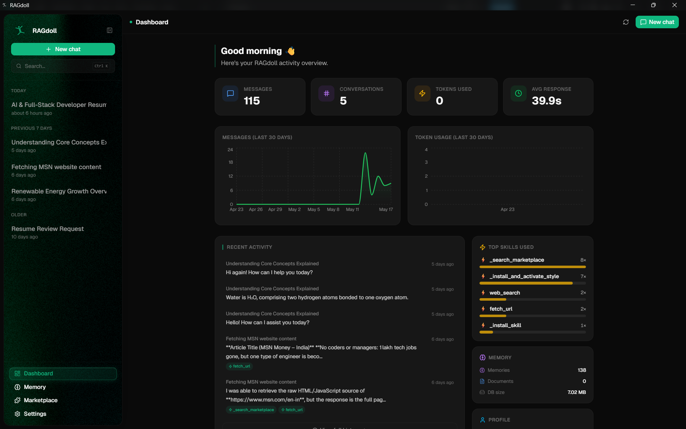

<div align="center">


# RAGdoll

**Local-first AI chat with retrieval-augmented generation.**  
Your conversations, your documents, your models — all on your machine.

[](https://github.com/itz-mune/RAGdoll/releases/latest)
[](https://github.com/itz-mune/RAGdoll/releases/latest)
[](LICENSE)

<!-- screenshot: drop a demo screenshot or GIF here -->


</div>

---

## What is RAGdoll?

RAGdoll is a desktop chat application that connects to the AI providers you already use while keeping every conversation and document stored **locally**. It automatically embeds your chat history and uploaded files into a private vector database, then retrieves the most relevant context for every message — no cloud, no telemetry, no subscriptions beyond your own API keys.

---

## 🆕 What's New — v0.2.0

### 📄 Document Creation (File R/W skill)
- **WeasyPrint PDF engine** — replaces reportlab as the primary PDF renderer; full CSS layout, custom fonts, page numbers, and header/footer via `@page` rules. reportlab remains as a fallback.
- **Image embedding** — the agent can now fetch images from the web and embed them directly into DOCX, PDF, and HTML documents.
- **Smart text-wrap** — images float left or right with text wrapping around them. Alignment is auto-detected from the image's aspect ratio (landscape → centre/full, portrait → float right) or controlled explicitly with ``, ``, ``, ``.
- **DOCX floating images** — uses native OOXML `wp:anchor` elements so Word honours the wrap style correctly.
- **PPTX & XLSX support** — `python-pptx` and `openpyxl` added for reading and writing PowerPoint and Excel files.

### 🖼️ Image Search plugin *(new)*
- Dedicated `image-search` skill — triggered only when the user explicitly asks for images or when the File R/W skill needs them for a document.
- **Four providers:** DuckDuckGo (default, no key), Unsplash, Pexels, Pixabay — switchable in plugin settings.
- **Dynamic settings fields** — API key inputs appear only for the selected provider (`show_if` conditional fields now supported across all plugin settings drawers).
- Pre-installed and auto-wired with the File R/W skill.

### 💬 Inline image display in chat
- Images returned by the agent are rendered as **Discord-style thumbnails** directly inside the chat bubble — loading skeleton, broken-URL fallback, and `cursor-zoom-in` hint.
- Click any image to open a **full-screen lightbox** with backdrop blur, smooth scale animation, and ESC / click-outside to dismiss.

### 🔄 Smarter update flow
- **Two-phase download/install** — clicking "Check for updates" no longer downloads immediately. A **Download** button appears first; progress, download speed (MB/s), bytes transferred, and ETA are shown inline while downloading. After download completes an **Install & restart** button appears.
- Same rich progress UI in both the top banner and the About settings tab.

### 🛠️ Other improvements
- **`/compact` slash command** — summarises and compresses long conversations to reclaim context window space.
- **Context-overflow protection** — the sidecar now detects token budget exhaustion and auto-compacts before hitting provider limits.
- **Universal File Access skill** — lets the agent read, search, and index files anywhere on disk.
- **Context-menu permission dialogs** for File R/W write/delete operations.
- **Onboarding polish** — correct repo links, white logo on the welcome screen, and a hidden `Ctrl+Shift+F1` shortcut to replay onboarding.
- **13 RAG performance optimisations** — ONNX-accelerated embedder, IVF-PQ index, prompt caching, LRU retrieval cache, semantic dedup, async HTTP pool, SSE compression, staged warm-up, and more.

---

## ✨ Features

| | |
|---|---|
| 🤖 **Multi-provider** | OpenAI, Anthropic, Groq, Google Gemini, Ollama, HuggingFace, OpenRouter |
| 🧠 **Persistent memory** | Every message and document is embedded locally with ONNX-accelerated `all-MiniLM-L6-v2` |
| 📄 **Document ingestion** | PDF, DOCX, TXT, CSV, JSON, PPTX, XLSX — drag-drop or attach inline |
| 📝 **Document creation** | Generate DOCX, PDF, HTML from chat — with images, text-wrap, and styled layouts |
| 🖼️ **Image search** | Find freely-licensed images (DDG / Unsplash / Pexels / Pixabay) and embed them in documents |
| 🔍 **Semantic search** | Full memory browser with search, filtering, and per-chunk management |
| 🧩 **Plugins** | Install community skills from the [RAGdoll Plugins repo](https://github.com/itz-mune/RAGdoll-plugins) |
| 👤 **Model profiles** | Named profiles per provider/model with separate API keys |
| 🖥️ **System tray** | Hide to tray, launch on startup, new chat from tray menu |
| 🔄 **Smart updates** | Background check; two-phase download/install with speed & ETA |
| 🎨 **Theming** | Dark / light / system, custom accent colour, font size & density |
| ⌨️ **Keyboard-first** | `Ctrl+N` new chat · `Ctrl+P` switch profile · `Ctrl+,` settings · and more |

---

## 🧩 Plugins

RAGdoll's skill system is fully plugin-based. All community plugins live in the dedicated plugins repository:

**[github.com/itz-mune/RAGdoll-plugins](https://github.com/itz-mune/RAGdoll-plugins)**

### Pre-installed skills

| Skill | Description |
|---|---|
| **File R/W** | Read, write, diff, and create rich documents (DOCX / PDF / HTML) with image embedding |
| **Universal File Access** | Index and search files anywhere on your filesystem |
| **Image Search** | Fetch freely-licensed images from the web; auto-wired with File R/W |
| **Web Search** | Live web search via DuckDuckGo / SearXNG |
| **YouTube Transcripts** | Pull transcripts from any YouTube video |

### Installing plugins

1. Open **Settings → Plugins**.
2. Browse the marketplace or paste a plugin URL.
3. Click **Install** — the skill is available immediately in the next chat.

### Building your own plugin

Each plugin is a folder with a `manifest.json` (name, description, config fields) and a `skill.py` (a LangChain tool class). See the [plugin authoring guide](https://github.com/itz-mune/RAGdoll-plugins#authoring-a-plugin) in the plugins repo for a full walkthrough.

---

## 📦 Installation

Download the latest installer for your platform from the [**Releases**](https://github.com/itz-mune/RAGdoll/releases/latest) page:

| Platform | File |
|---|---|
| **Windows** | `RAGdoll_0.2.0_x64-setup.exe` or `_x64_en-US.msi` |
| **macOS (Apple Silicon)** | `RAGdoll_0.2.0_aarch64.dmg` |
| **macOS (Intel)** | `RAGdoll_0.2.0_x86_64.dmg` |
| **Linux** | `RAGdoll_0.2.0_amd64.AppImage` or `_amd64.deb` |

> **macOS:** If Gatekeeper blocks the app, right-click → Open on first launch.

> **Windows:** RAGdoll requires [WebView2](https://developer.microsoft.com/en-us/microsoft-edge/webview2/). Windows 11 and Windows 10 (post-2021) already include it — the installer will download it automatically on older systems.

> **Linux:** RAGdoll requires `libwebkit2gtk-4.1`. Install it with:
> ```bash
> sudo apt install libwebkit2gtk-4.1-0   # Ubuntu / Debian / Mint
> sudo dnf install webkit2gtk4.1          # Fedora / RHEL
> ```
> Alternatively, use the `.AppImage` which bundles most dependencies.

---

## 🚀 Build from source

### Prerequisites

| Tool | Version |
|---|---|
| [Rust](https://rustup.rs) | stable |
| [Node.js](https://nodejs.org) | 20+ |
| [pnpm](https://pnpm.io) | 9+ |
| [uv](https://docs.astral.sh/uv/) | latest |

> **Windows (PDF support):** WeasyPrint requires GTK3 runtime libraries. Install via the [GTK3 for Windows runtime installer](https://github.com/tschoonj/GTK-for-Windows-Runtime-Environment-Installer/releases) or via MSYS2:
> ```bash
> pacman -S mingw-w64-x86_64-gtk3 mingw-w64-x86_64-pango mingw-w64-x86_64-cairo
> ```

### Steps

```bash
# 1. Clone
git clone https://github.com/itz-mune/RAGdoll.git
cd RAGdoll

# 2. Install frontend dependencies
pnpm install

# 3. Install Python sidecar dependencies
cd sidecar && uv sync && cd ..

# 4. Run in development mode
pnpm tauri dev
```

The first run downloads and converts the embedding model to ONNX (~1 min, one-time).

### Production build

```bash
pnpm tauri build
```

---

## 🏗️ Tech stack

| Layer | Technology |
|---|---|
| **Shell** | [Tauri v2](https://tauri.app) (Rust) |
| **Frontend** | React 19 · TypeScript · Vite · Tailwind CSS v4 |
| **Sidecar** | Python · FastAPI · uvicorn |
| **AI** | [LangChain](https://langchain.com) · [LangGraph](https://langchain-ai.github.io/langgraph/) |
| **Memory** | [LanceDB](https://lancedb.com) · ONNX Runtime · `all-MiniLM-L6-v2` |
| **State** | Zustand · Tauri plugin-store |
| **PDF** | WeasyPrint (primary) · reportlab (fallback) |
| **Documents** | python-docx · python-pptx · openpyxl · Pillow |
| **Packaging** | PyInstaller · GitHub Actions (Win / macOS / Linux) |

---

## 🤝 Contributing

Pull requests are welcome. For major changes please open an issue first.

```bash
# Type-check frontend
pnpm tsc --noEmit

# Lint Rust
cd src-tauri && cargo clippy
```

See [RELEASING.md](RELEASING.md) for the release workflow.

---

## 📄 License

[MIT](LICENSE)
